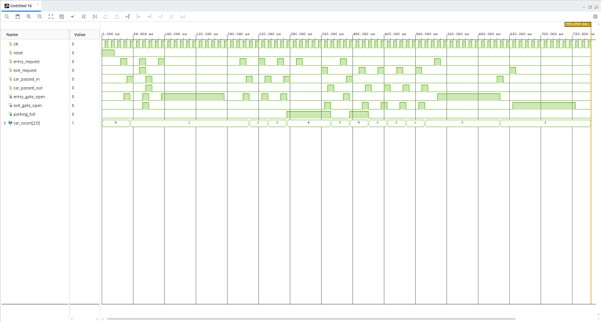
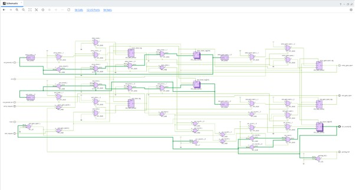
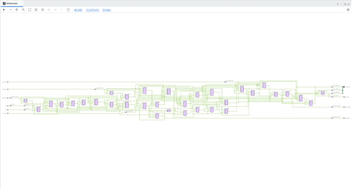
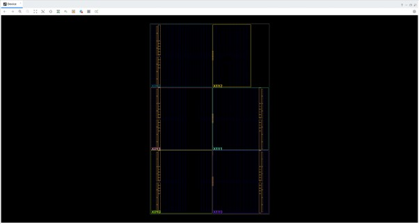
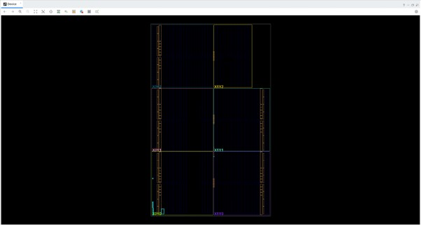
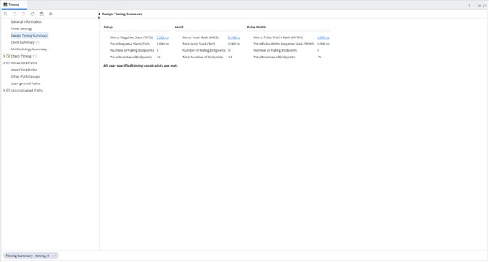
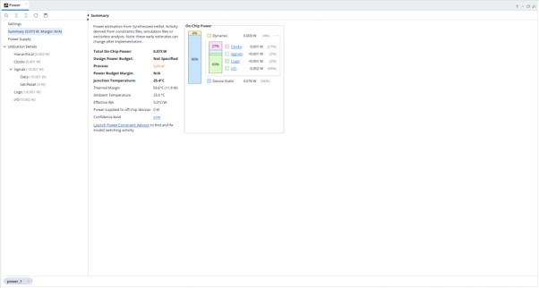

# Parameterized Car Parking Controller in Verilog

A Verilog RTL controller for a parking area with separate entry and exit gates. The design tracks occupancy, controls both gates independently, and updates the car count only after passage is confirmed.

This project follows my traffic light and elevator controller projects. I used it to practise coordinating two gate controllers while managing a shared occupancy register.

The design was simulated, synthesized, and implemented in AMD Vivado 2026.1 for the Artix-7 `xc7a35tcpg236-1` FPGA.

## Design Overview

The controller distinguishes between a request to open a gate and confirmation that a car has passed through it.

An entry request opens the entry gate when space is available. The occupancy count increases only when `car_passed_in` is received while the gate is open.

An exit request opens the exit gate when at least one car is inside. The occupancy count decreases only when `car_passed_out` is received while the gate is open.

If passage is not confirmed within the configured timeout, the corresponding gate closes and occupancy remains unchanged.

### Main Features

- Configurable parking capacity
- Independent entry and exit gate control
- Separate state registers and timers for both gates
- Occupancy updates based on confirmed passage
- Simultaneous entry and exit handling
- Entry blocking when parking is full
- Exit blocking when parking is empty
- Configurable gate timeout
- Passage confirmation takes priority over timeout
- Active-high asynchronous reset

## Module Interface

The design module is named `Car_parking_Design`.

| Signal | Direction | Width | Purpose |
|---|---|---|---|
| `clk` | Input | 1 bit | Controller clock |
| `reset` | Input | 1 bit | Active-high asynchronous reset |
| `entry_request` | Input | 1 bit | Requests entry gate opening |
| `exit_request` | Input | 1 bit | Requests exit gate opening |
| `car_passed_in` | Input | 1 bit | Confirms passage through the entry gate |
| `car_passed_out` | Input | 1 bit | Confirms passage through the exit gate |
| `entry_gate_open` | Output | 1 bit | Entry gate control |
| `exit_gate_open` | Output | 1 bit | Exit gate control |
| `parking_full` | Output | 1 bit | Indicates that occupancy equals capacity |
| `car_count` | Output | `$clog2(CAPACITY+1)` bits | Current occupancy |

Request and passage inputs are driven as one-clock pulses in the testbench.

## Parameters

| Parameter | Default | Description |
|---|---:|---|
| `CAPACITY` | 4 | Maximum number of cars |
| `GATE_TIMEOUT` | 10 | Clock cycles allowed for passage confirmation |

Both parameters must be positive integers.

With the default capacity, `car_count` is three bits wide and can represent occupancy from 0 through 4.

Timer width is calculated from `GATE_TIMEOUT`, with a minimum width of one bit. For the default timeout, each four-bit timer counts from 0 through 9.

The timeout is specified in clock cycles. At the testbench's 10 ns clock period, ten cycles correspond to 100 ns. These short values make the behavior easy to observe in simulation.

## Gate Control

Each gate has two states:

| State | Encoding | Operation |
|---|---|---|
| `close` | `1'b0` | Gate is closed and its timer is cleared |
| `open` | `1'b1` | Gate waits for passage confirmation or timeout |

### Entry Gate

In the closed state, the entry controller checks `entry_request` and `parking_full`.

If entry is requested and parking is not full, the gate opens. While open:

1. Passage confirmation closes the gate and clears its timer.
2. Otherwise, reaching `GATE_TIMEOUT - 1` closes the gate without confirming entry.
3. Otherwise, the timer increments and the gate remains open.

### Exit Gate

The exit controller follows the same sequence, using `exit_request`, `car_passed_out`, and its own timer.

The exit gate opens only when `car_count` is greater than zero.

Because the gates have separate state registers and timers, both can operate during the same clock cycle.

### Passage on the Timeout Boundary

Passage confirmation is checked before timer expiration.

If confirmation arrives on the final allowed cycle, the passage is accepted and the count is updated. This prevents a valid final-cycle passage from being treated as a timeout.

## Shared Occupancy Update

The design qualifies each passage signal with its corresponding open gate:

- `entry_done`: entry gate is open and entry passage is confirmed
- `exit_done`: exit gate is open and exit passage is confirmed

A single shared section updates `car_count`.

| Entry confirmed | Exit confirmed | Occupancy update |
|---|---|---|
| 0 | 0 | No change |
| 1 | 0 | Increase by one if below capacity |
| 0 | 1 | Decrease by one if above zero |
| 1 | 1 | No change |

For example, if two cars are inside and one enters while another exits, occupancy remains at two.

Keeping the count update in one section avoids competing nonblocking assignments from the entry and exit controllers.

The full indication is generated continuously:

```verilog
assign parking_full = (car_count == CAPACITY);
```

## Reset Behavior

Asserting `reset`:

- Closes both gates
- Sets both state registers to `close`
- Clears both gate timers
- Clears the occupancy count

With positive capacity, `parking_full` is low after reset.

## Simulation and Verification

The testbench generates a 10 ns clock and changes stimulus on falling clock edges. This allows inputs to settle before the controller samples them on rising edges.

Verification was performed by inspecting behavioral simulation waveforms.

| Test | Expected Behavior |
|---|---|
| Normal entry | Gate opens, confirmed passage increases occupancy, gate closes |
| Normal exit | Gate opens, confirmed passage decreases occupancy, gate closes |
| Simultaneous passage | Both passages are accepted and occupancy remains unchanged |
| Entry timeout | Entry gate closes without increasing occupancy |
| Full parking | Further entry requests are blocked |
| Recovery from full parking | An exit clears the full indication and permits another entry |
| Empty parking | Further exit requests are blocked and occupancy remains zero |
| Final-cycle passage | Passage confirmation takes priority over timeout |
| Exit timeout | Exit gate closes without decreasing occupancy |



## RTL and Synthesis

Vivado elaboration shows the registers, comparisons, arithmetic, and multiplexers inferred from the RTL.



Synthesis maps this logic into resources available on the selected Artix-7 FPGA.



The synthesis utilization report is included below.


## Implementation

The synthesized design was placed and routed for the selected FPGA target.

### Synthesized Device View



### Implemented Device View



## Timing Analysis

The XDC file defines a 10 ns clock period, corresponding to 100 MHz:

```tcl
create_clock -name clk -period 10.000 [get_ports clk]
```

The timing summary reported the following results:

| Metric | Result |
|---|---:|
| Clock period | 10.000 ns |
| Worst Negative Slack (WNS) | +7.522 ns |
| Total Negative Slack (TNS) | 0.000 ns |
| Worst Hold Slack (WHS) | +0.142 ns |
| Total Hold Slack (THS) | 0.000 ns |
| Worst Pulse Width Slack | +4.500 ns |
| Failing endpoints | 0 |

All user-specified timing constraints were met for the constrained paths. The supplied XDC defines the clock; external input and output timing requirements are not specified.



## Power Analysis

The post-implementation Vivado power report is included below.

Its values are estimated from the implemented circuit and configured activity and operating conditions. They are not measurements from a physical FPGA board.



## Repository Contents

| Path | Contents |
|---|---|
| `Car_parking_Design.v` | Synthesizable controller RTL |
| `Car_parking_testbench.v` | Behavioral simulation testbench |
| `Car_parking_constraints.xdc` | Clock timing constraint |
| `Images/` | Simulation, schematic, utilization, implementation, timing, and power screenshots |
| `README.md` | Project documentation |

## Running the Project

1. Create an RTL project in Vivado.
2. Select the Artix-7 part `xc7a35tcpg236-1`.
3. Add `Car_parking_Design.v` as a design source.
4. Add `Car_parking_testbench.v` as a simulation source.
5. Add `Car_parking_constraints.xdc` as a constraint source.
6. Set `Car_parking_Design` as the design top.
7. Set `Car_parking_testbench` as the simulation top.
8. Run behavioral simulation.
9. Run synthesis and implementation to reproduce the FPGA reports.

## Current Scope

This is an RTL model of gate control and occupancy tracking.

The current implementation assumes request and passage signals are synchronous to `clk`. It does not include physical sensor synchronization, debouncing, motor control, or an obstruction sensor.

Request inputs are level-sensitive. A request held high can reopen a gate after it closes, so the testbench uses one-clock request pulses.

Gate timeout closes the gate without changing occupancy. A separate timeout error output is not implemented.

The FPGA implementation was analysed in Vivado; operation on a physical parking system or FPGA board has not been demonstrated.

## Author

Devaananth
